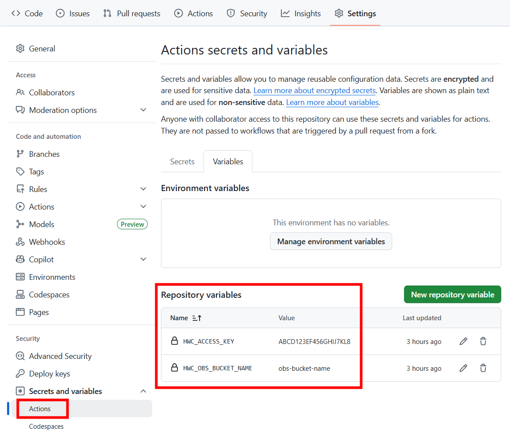
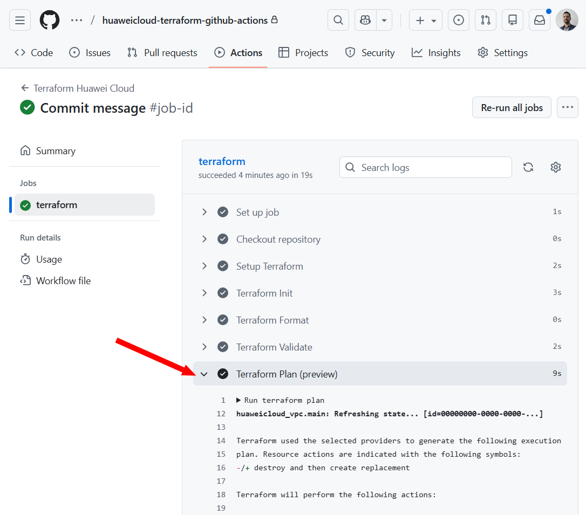
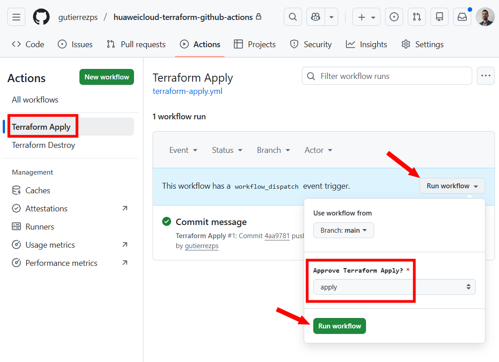
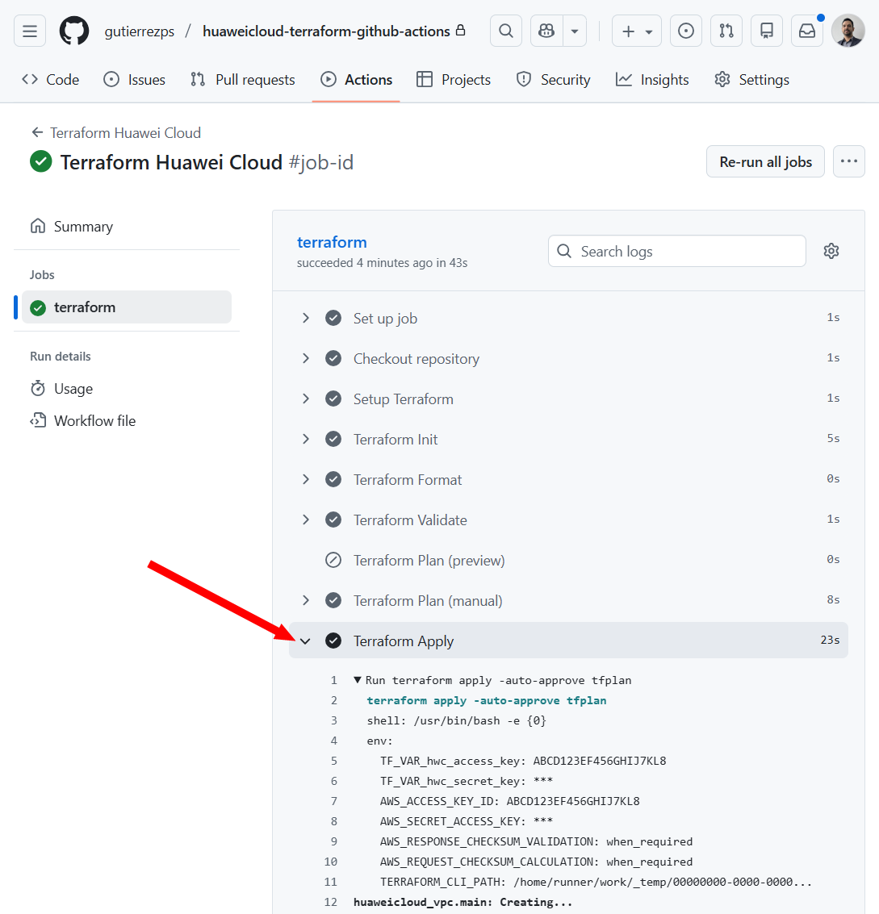
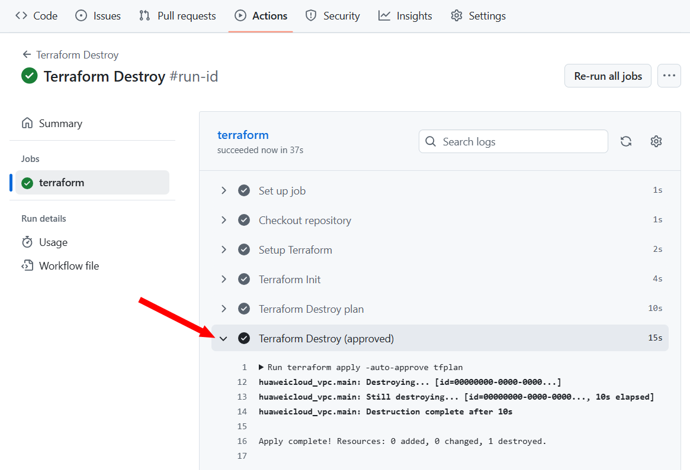

# Huawei Cloud Terraform com GitHub Actions

🌐 **Idioma**: [English](./README.md) | **Português**

<!-- markdownlint-disable MD033 -->

Este repositório contém arquivos [Terraform][terraform] para implantar uma
infraestrutura mínima da [Huawei Cloud][hwc] (uma [VPC][vpc]) usando
[GitHub Actions][actions].

- [Huawei Cloud Terraform com GitHub Actions](#huawei-cloud-terraform-com-github-actions)
  - [Pré-requisitos](#pré-requisitos)
  - [Configurar segredos e variáveis do GitHub](#configurar-segredos-e-variáveis-do-github)
  - [Fluxo de implantação](#fluxo-de-implantação)
  - [Destruindo a infraestrutura](#destruindo-a-infraestrutura)
  - [Leitura adicional](#leitura-adicional)

## Pré-requisitos

- [Conta na Huawei Cloud][hwc-account];
- [Chaves de Acesso (AK/SK)][aksk] de um
  [Usuário IAM com acesso programático][iam-prog] e permissão para implantar os
  recursos utilizados;
- Bucket do [Huawei Cloud OBS][obs] para armazenar o arquivo de estado
  remotamente (o usuário IAM deve ter
  [permissões de leitura e escrita no bucket][bucket-policy]).

## Configurar segredos e variáveis do GitHub

No seu repositório GitHub:

1. Vá em **Settings** → **Secrets and variables** → **Actions**
2. Adicione as seguintes *repository variables*:

    | Nome da Variable         | Descrição                                   |
    | ------------------------ | ------------------------------------------- |
    | `HWC_ACCESS_KEY`         | Access Key (AK) da Huawei Cloud             |
    | `HWC_OBS_BUCKET_NAME`    | Nome do bucket OBS para armazenar o tfstate |

3. Adicione o seguinte *repository secret*:

    | Nome da Secret           | Descrição                              |
    | ------------------------ | -------------------------------------- |
    | `HWC_SECRET_KEY`         | Secret Access Key (SK) da Huawei Cloud |

## Fluxo de implantação

Sempre que código novo for enviado para a branch `main`, o GitHub Actions irá:

1. Inicializar o Terraform (`terraform init`)
2. Verificar a formatação do código (`terraform fmt -check`)
3. Validar a configuração (`terraform validate`)
4. Gerar um plano (`terraform plan`)

Após revisar o plano, se você concordar com ele, é necessário executar
manualmente o workflow para provisionar a infraestrutura na Huawei Cloud:

1. Vá na aba **Actions**;
2. Selecione a action **Terraform Apply**;
3. Clique em **Run workflow** no lado direito;
4. Em **Approve Terraform Apply?**, selecione **apply** e clique em
   **Run workflow**;
5. As alterações de infraestrutura serão aplicadas automaticamente.

## Destruindo a infraestrutura

Se você desejar destruir a infraestrutura através do GitHub Actions, execute
manualmente o workflow **Terraform Destroy**. Selecione a opção
**skip** ao executar o workflow para visualizar o que será feito e, se concordar
com o plano, selecione a opção **apply** ao executar o workflow manualmente
novamente.

## Leitura adicional

- Huawei Cloud Terraform Boilerplate: <https://github.com/huaweicloud-latam/terraform-boilerplate>
- Documentação do provider Terraform da Huawei Cloud: <https://registry.terraform.io/providers/huaweicloud/huaweicloud/latest/docs>
- Configuração de estado remoto do Terraform: <https://github.com/huaweicloud-latam/terraform-boilerplate/blob/main/doc/remote_state.pt.md>

[terraform]: <https://developer.hashicorp.com/terraform/docs>
[hwc]: <https://www.huaweicloud.com/intl/en-us>
[actions]: <https://docs.github.com/en/actions>
[hwc-account]: <https://support.huaweicloud.com/intl/en-us/usermanual-account/account_id_001.html>
[aksk]: <https://support.huaweicloud.com/intl/en-us/usermanual-ca/ca_05_0003.html>
[iam-prog]: <https://support.huaweicloud.com/intl/en-us/usermanual-iam5/iam_01_1150.html>
[obs]: <https://support.huaweicloud.com/intl/en-us/obs/index.html>
[bucket-policy]: <https://support.huaweicloud.com/intl/en-us/usermanual-obs/obs_03_0142.html>
[vpc]: <https://support.huaweicloud.com/intl/en-us/vpc/index.html>
